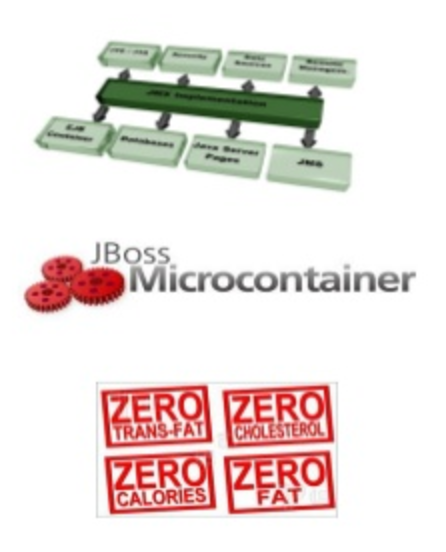

class: center, middle

# WildFly Swarm

## Putting the “Micro” in Microservices with WildFly Swarm
_Do you like JavaEE apps, but wonder how to fit them into a microservices-centric workflow?_

---

# JBoss Application Server `=>` WildFly

.left-column[
* JBoss AS 2.x, 3.x, 4.x
 * JMX MicroKernel

* JBoss AS 5.x, 6.x
 * JBoss MicroContainer

* AS7.x, WildFly 8.x, 9.x, 10.x
 * Modular Service Container]

.right-column[

]

---

# How WildFly Swarm Works

WildFly Swarm builds on the foundation of WildFly

simply put, WildFly Swarm lets you take a JavaEE app and _boil it down to only the essential parts necessary_ to run it as an uber-JAR file

the result is a leaner, meaner way to deploy Java apps

WildFly Swarm is here and ready for production now

What is Java EE anyway?

---

# What is Java EE?

It’s different things to different people:

* A collection of (useful) API’s
* Technical capabilities of a system
* A love/hate relationship (of the past)
* (Existing) knowledge and expertise

What if I don't want to use all the Java EE API? Uberjar!

What is Uberjar anyway?

---

# What is Uberjar?

* a single `.jar` file containing your application
* the portions of WildFly required to support it
* an internal Maven repository of dependencies
* plus a shim to bootstrap it all

### How to collect all the API I want?

Fractions!

* a well-defined collection of application capabilities
* may map directly to a WildFly subsystem
* or bring in external capabilities such as Netflix Ribbon.

???
Example Fractions Datasources Keycloak (SSO) Undertow (Http/Web) EJB Messaging Clustering JAX-RS JPA Infinispan Transactions CDI Management

---

# Why WildFly Swarm?

So, why run your Java apps in an application server that has many pieces that aren’t used?

cutting out the fat via WildFly Swarm, you get an app and application server combined uber-JAR that

* sucks up less memory
* is more responsive

perfect fit for providing a single artifact to be passed through the entire CI/CD pipeline

you can compile and deploy just the parts you need, and leave out everything you don’t.

---

# Setting Up WildFly Swarm

Excited yet?

```xml
<plugin>
  <groupId>org.wildfly.swarm</groupId>
  <artifactId>wildfly-swarm-plugin</artifactId>
  <executions>
    <execution>
      <phase>package</phase>
      <goals>
        <goal>package</goal>
      </goals>
    </execution>
  </executions>
</plugin>
```

---

# Setting Up WildFly Swarm

Watch this

```java
public static void main(String[] args) throws Exception {

    Swarm container = new Swarm();

    container.start();

    JavaArchive deployment = ShrinkWrap
    	.create( JavaArchive.class, "myapp.jar" );

    deployment.addClass(MyService.class);

    container.deploy(deployment);
}
```

---

class: center, middle

# DEMO

---

class: center

# But Wait, There's More!


---

class: center

# But Wait, There's More!


---

class: center, middle

# DEMO

---

# Links:

WildFly Swarm

* [WildFly Swarm Documentation](http://wildfly-swarm.io/documentation/)
* [Developers Red Hat Blog](https://developers.redhat.com/blog/tag/swarm/)
* [WildFly-Swarm and Docker](https://github.com/wildfly-swarm/wildfly-swarm-examples/tree/master/docker)

Microservices and MicroProfile

* [Middleware Track: EAP 7, Swarm, Vert.x, OpenShift](http://www.slideshare.net/ugolandini/osd-2016-middleware-track)
* [Writing Java EE microservices using WildFly Swarm](http://www.slideshare.net/comsysto/writing-java-ee-microservices-using-wildfly-swarm)
* [Rightsize Your Services with WildFly & WildFly Swarm](http://www.slideshare.net/voxxedthessaloniki/voxxed-days-thesaloniki-2016-rightsize-your-services-with-wildfly-wildfly-swarm)
* [An introduction to the MicroProfile](http://www.slideshare.net/asotobu/an-introduction-to-the-microprofile)
* [Docker for Java Developers](http://www.slideshare.net/Nginx/docker-for-java-developers-67693757)

---

class: center, middle

# Questions